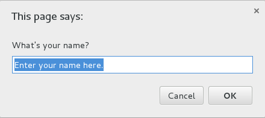

* JavaScript will not allow you to read/wirte the document of user in hard disk.
***
* function `prompt()` in JavaScript.
```
var userName = prompt("What's your name?", "Enter your name here.");
```
The result of this code is:  
  
This function prompt will return the message what you enter.
***
* JavaScript has three base type of data: text, number and boolean.  
***
* The definition of const value in JavaScript.  
```
const a = "abc";
```
***
When reloading the page, the data will be reset. With another word, the result of executing the script is the same as firstly executing.  
***
* NaN, 非数字  
某个应该使数字的值不见时就会出现NaN
```
const DONUTPRICE;
var numCakeDonuts = 0;
var numGlazedDonuts = 12;
var subTotal = (numCakeDonuts + numGlazedDonuts) * DONUTPRICE;
```
因为`DONUTPRICE`没有定义，所以`subTotal`的值为：`subTotal = (0 + 2) * ?`，所以`subTotal`就会出现NaN。  
***  
* 文本和boolean型的数据会被视为NaN吗？  
NaN并不是一般的JavaScript数据描述方式，它是一种你需要数据却收到的是非数值数据的指标，只有这个时候才会出现NaN。  
***
* `parseInt()`和`parseFloat()`  
parseInt(): 把字符串转化为整数  
parseFloat(): 把字符串转化为浮点数  
转换不成功：
```
parseFloat("$31.50") = NaN;
// parseFloat("31.50$") = 31.5;
// parseFloat("31.50$33") = 31.5;
// parseInt("31.5") = 31;
```
***  
* isNaN()  
验证是否不是一个数字  
```
isNaN(document.getElementById("abc").value);
//如果是数字则返回false，否则返回true
```
***
* 如何判断一个字符串中是否存在某一字符串？  
判断`indexOf()`的返回值是不是等于-1.  
```
if (abcString.indexOf("abc") != -1) {
    ....
}
```

