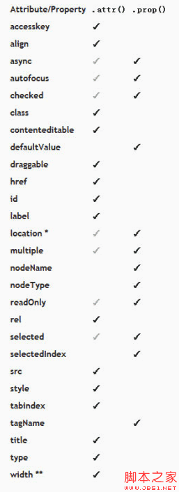

* $("p").live("click", data, function(){...});  
绑定一个或多个事件，可以绑定由代码生成的元素。
***
* $("p").unbind("click").on("click",function(){...});  
解除绑定后绑定单击事件。
***
* p:nth-child(n)  
```
<div>
    <p></p>
    <p></p>
    <p></p>
    <p></p>
    <p></p>
    <p></p>
</div>
```
(1) p:nth-child(3) means you have choose the third `<p>` element in parent element `<div>`.  
(2) p:nth-child(3n+1) the parameter n will increase start with 0.  
***
* function `prop()` in jQuery.  
(1) .prop(propertyName)  
This function means getting the property of the first element in matched list.  
(2) .prop(propertyName, value), .prop(map)  
Setting one or more attributes to the matched elements in list.  
(3) differences between `attr()` and `prop()`  
```
if ( elem.checked ) 
if ( $(elem).prop("checked") ) 
if ( $(elem).is(":checked") ) 
```
These three sentences will return value which type is boolean.  
```
        .attr()                Proper.prop() usage
   $(window).attr...          $(window).prop...
   $(document).attr..         $(document).prop...
```
If window or document use .attr() in jQuery1.6, it will doesn't work, because window and document can't have attributes. In jQuery1.6.1, when window or document use .attr(), it will change to .prop() automatically.  
  
***
* `disabled` attribute in jQuery.  
The function of `disabled` is to avoid using a certain element.  

